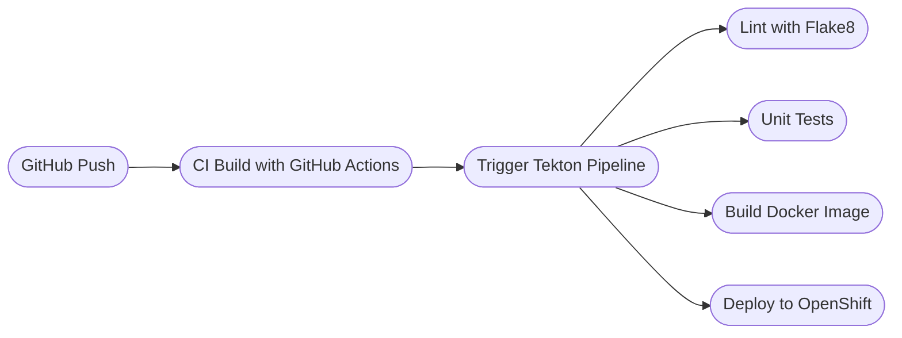

# 🛠CI/CD with Tekton and OpenShift

[](https://github.com/GLD145/devops-capstone-project/actions)
[](LICENSE)
[](https://www.python.org/downloads/release/python-390/)
[](https://github.com/guylandrydjolaud)

---

##  Overview

This project is part of the IBM “DevOps and Software Engineering” professional certification.  
It showcases a complete CI/CD pipeline using **GitHub Actions and Tekton on OpenShift**, following a **Test-Driven Development (TDD)** approach.

I personalized and extended the base project to demonstrate my ability to automate the DevOps lifecycle in a cloud-native environment.

---

##  Tech Stack

-  CI/CD: GitHub Actions, Tekton Pipelines  
-  Testing: Python `unittest`, Nose, Flake8  
-  Containerization: Docker, Buildah  
-  Orchestration: OpenShift, K3D (local Kubernetes)  
-  Database: PostgreSQL via Docker  
-  Dev Tools: Makefile, VSCode Remote Containers, Python 3.9  

---

##  CI/CD Architecture (Tekton Pipeline)



##  Project Structure

```text
├── service/                # Python microservice (Flask)
│   ├── config.py
│   ├── models.py
│   └── routes.py
├── tests/                  # Unit tests
│   ├── factories.py
│   ├── test_models.py
│   └── test_routes.py
├── Dockerfile
├── Makefile
└── ci-build.yaml          # GitHub Action workflow
```
